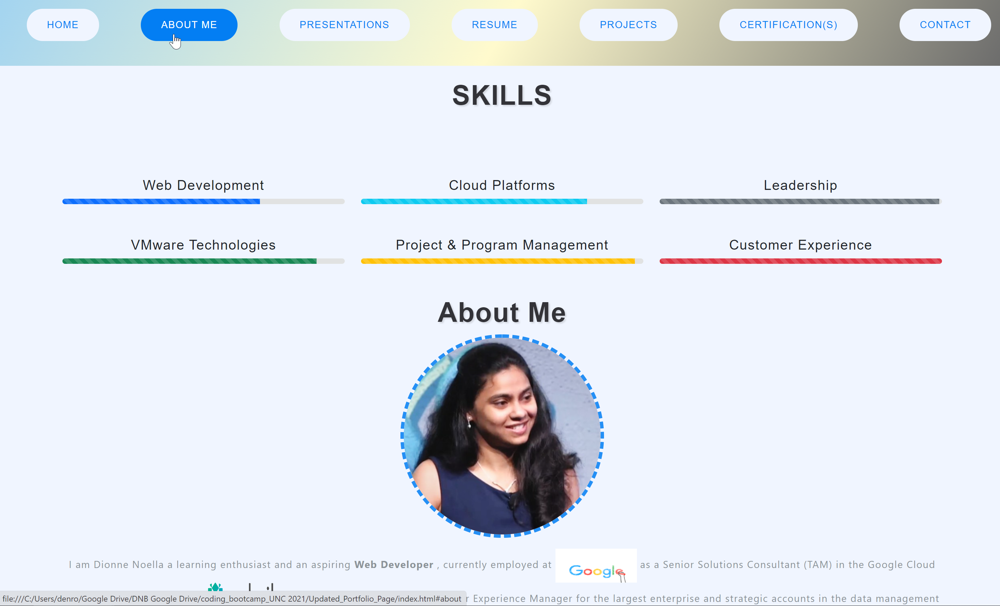

# Updated Portfolio Page

```
In this Homework, now that we've had some practice with APIs and have a project to share, we'll be updating our portfolio page and other materials to build a website/ Portfolio towards being employer-competitive!
```

### User Story
```
AS AN employer I WANT to view a potential employee's deployed portfolio of work samples SO THAT I can review samples of their work and assess whether they're a good candidate for an open position
```

### Acceptance Criteria
```
GIVEN a webpage meets accessibility standards
✓ Display your contact information. If you don't want to share your personal email or phone number, use a separate email that you will only use for coding, also known as a developer email, and/or a call forwarding service, such as [Google Voice](https://voice.google.com/)
✓ Have links to your GitHub profile and LinkedIn profile
✓ Have a link to a downloadable PDF of your resume
✓ Display at least 2 examples of student work from either deployed projects or homeworks 
✓ Have a polished, mobile-responsive user interface.
```

--------------------------------
# DNB's SOLUTION: 
UNC Boot Camp Submission: 🗂️ [Github Repository](https://github.com/DionneNoellaBarretto/Updated_Portfolio_Page) | 📄[Github Page](https://dionnenoellabarretto.github.io/Updated_Portfolio_Page/)

Previous Work in Progress Solution: 🗂️ [Github Repository](https://github.com/DionneNoellaBarretto/02-Advanced-CSS-Portfolio) | 📄[Github Page](https://dionnenoellabarretto.github.io/02-Advanced-CSS-Portfolio/)

--------------------------------

### Grading Requirements

This homework is graded based on the following criteria: 

#### Technical Acceptance Criteria: 40%
Satisfies all of the preceding acceptance criteria

#### Deployment: 32%
```
✅ Application deployed at live URL
✅ Application loads with no errors
✅ Application GitHub URL submitted
✅ GitHub repository contains application code
```
#### Application Quality: 15%
```
✅ Application resembles mock-up provided in the homework instructions 
```

#### Repository Quality: 13%
```
✅ Repository has a unique name
✅ Repository follows best practices for file structure and naming conventions
✅ Repository follows best practices for class/id naming conventions, indentation, quality comments, etc
✅ Repository contains multiple descriptive commit messages
✅ Repository contains quality README file with description, screenshot, and link to deployed application
```

### Mockup - Desktop, Tablet & Mobile Views
Landing Page with intuitive Hover Capabilities that highlights and upon click moves to that section

Intuitive Project Display Card Layout

Tablet Screen View with image highlight border color changing & Skills view appearing column like

Mobile Screen View


